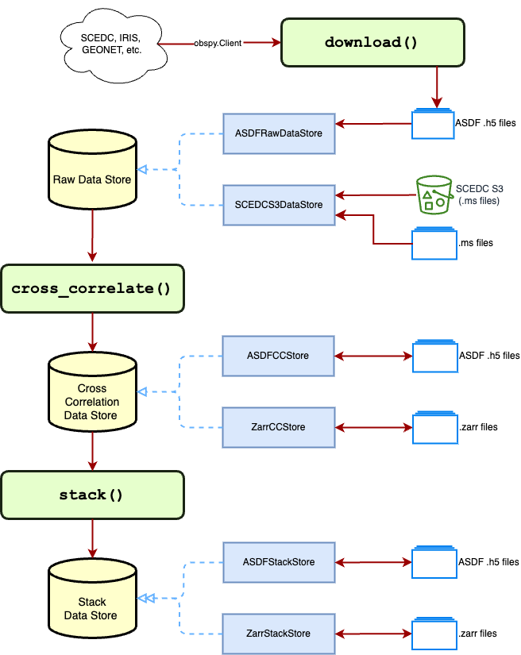

# Contributing

There are multiple ways in which you can contribute:

**Report a bug**: To report a suspected bug, please raise an issue with the ```bug``` label on Github. Please try to give a short but complete description of the issue.

**Suggest a feature**: To suggest a new feature, please raise an issue with the ```enhancement``` label on Github. Please describe the feature and the intended use case.

## Developing NoisePy

NoisePy is going under major re-development. Part of the core development involves adding data objects and stores, modularizing it to facilitate community development, and giving alternative workflows for HPC, Cloud, and DAS.

Fork the repository, and create your local version, then follow the installation steps:
```bash
conda create -n noisepy -y python=3.10 pip mpi4py
conda activate noisepy
python -m ipykernel install --user --name noisepy
pip install -e ".[dev,aws,mpi]"
```
It will install all of the dependencies of the package, including IPython to start a jupyter notebook (excluded otherwise to minimmize dependencies for command line deployment).

Install the `pre-commit` hook:
```bash
pre-commit install
```
This will run the linting and formatting checks configured in the project before every commit.

## Testing

When making changes, please run the following two tests:

Unit tests:
```
pytest ./tests ./integration_tests
```

CLI Integration tests:
```
tests/test_cli.sh numpy
tests/test_cli.sh asdf
```

NOTE: The CLI tests download a small amount of data from SCEDC to test the download funcionality. Occassionally, the service
is unavailable and the test will fail. This is usually resolved in a few minutes.

## Pull Requests

Please follow the [Conventional Commits](https://github.com/uw-ssec/rse-guidelines/blob/main/fundamentals/conventional-commits.md) naming for pull request titles.

## Overview


The data processing in NoisePy consists of three steps:

1. **(Optional) Step 0 - Download**: The `download()` function or the `noisepy download` CLI command can be
used to download data from an FDSN web service. Alternatively, data from an [S3 bucket](https://s3.console.aws.amazon.com/s3/buckets/scedc-pds) can be copied locally using the AWS CLI, or streamed directly from S3.
2. **Step 1 - Cross Correlation**: Computes cross correlaton for pairs of stations/channels. This can done with either the `cross_correlate()` function or the `noisepy cross_correlate` CLI command.
3. **Step 2 - Stacking**: This steps takes the cross correlation computations across multiple timespans and stacks them for a given station/channel pair. This can done with either the `stack_cross_correlations()` function or the `noisepy stack` CLI command.

### Data Formats

NoisePy accesses data through 3 "DataStore" abstract classes: `RawDataStore`, `CrossCorrelationDataStore` and `StackDataStore`. Concrete implementations are provided for ASDF and miniSEED formats (Zarr is in progress). Support for other formats or file organizations can be extended through these classes.
