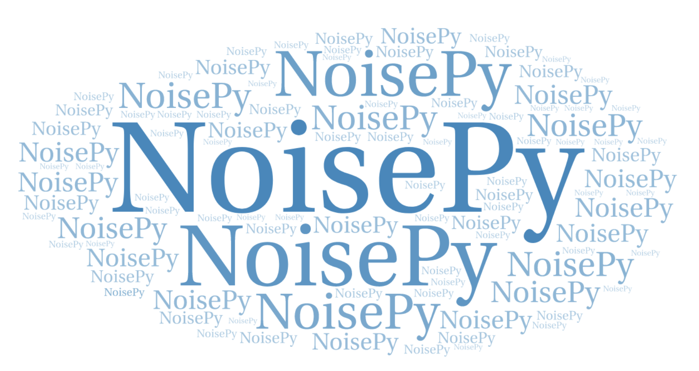

Welcome to NoisePy
==================

This is the documentation for the Python package of **NoisePy**, which is a new high-performance python tool for seismic ambient noise seismology. For further information and contact information please
see below website:

* Github repository of *NoisePy*: https://github.com/noisepy/NoisePy

If you use NoisePy for your research and prepare publications, please consider citing **NoisePy**:

* Jiang, C., Denolle, M. 2020. NoisePy: a new high-performance python tool for ambient noise seismology. Seismological Research Letters. 91, 1853-1866. `DOI:10.1785/0220190364 <https://pubs.geoscienceworld.org/ssa/srl/article-abstract/91/3/1853/583390/NoisePy-A-New-High-Performance-Python-Tool-for?redirectedFrom=fulltext>`_.

The monitoring modules are a compilation of published Python scripts and include the new approach described in:
* Yuan, C., Bryan, J., Denolle, M.A.: Comparing approaches to measuring time- and frequency-dependent seismic phase variations for coda wave interferometry. In prep for *Geophysical Journal International*.
Please cite this paper if using the monitoring module

The stacking subroutines have been compiled from various published methods. Please cite appropriate article when using a particular stacking routine (references are listed in the documentation).

We gratefully acknowledge support from the Packard Fundation (`www.packard.org <http://www.packard.org>`_).

Functionality
--------------

* Download continous noise data based on obspy's core functions of `get_station <https://docs.obspy.org/packages/autogen/obspy.clients.fdsn.client.Client.get_stations.html>`_ and `get_waveforms <https://docs.obspy.org/packages/autogen/obspy.clients.fdsn.client.Client.get_waveforms.html>`_
* Save seismic data in `ASDF <https://asdf-definition.readthedocs.io/en/latest/>`_ format, which convinently assembles meta, wavefrom and auxililary data into one single file (`Tutorials <https://github.com/SeismicData/pyasdf/blob/master/doc/tutorial.rst>`_ on reading/writing ASDF files)
* Offers high flexibility to handle messy SAC/miniSEED data stored on your local machine and convert them into ASDF format data that could easily be pluged into NoisePy
* Performs fast and easy cross-correlation with functionality to run in parallel through `MPI <https://en.wikipedia.org/wiki/Message_Passing_Interface>`_
* Includes a series of monitoring functions to measure dv/v on the resulted cross-correlation functions using some recently developed new methods (see our papers for more details)

.. toctree::
    :hidden:
    :maxdepth: 3
    :glob:

    installation
    tutorial
    examples
    applications
