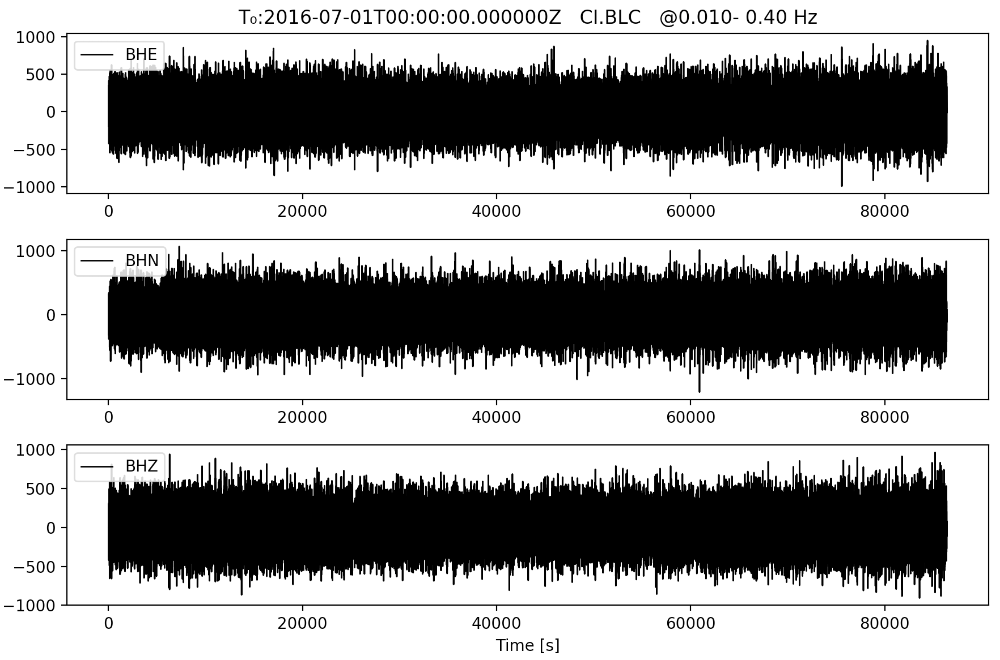
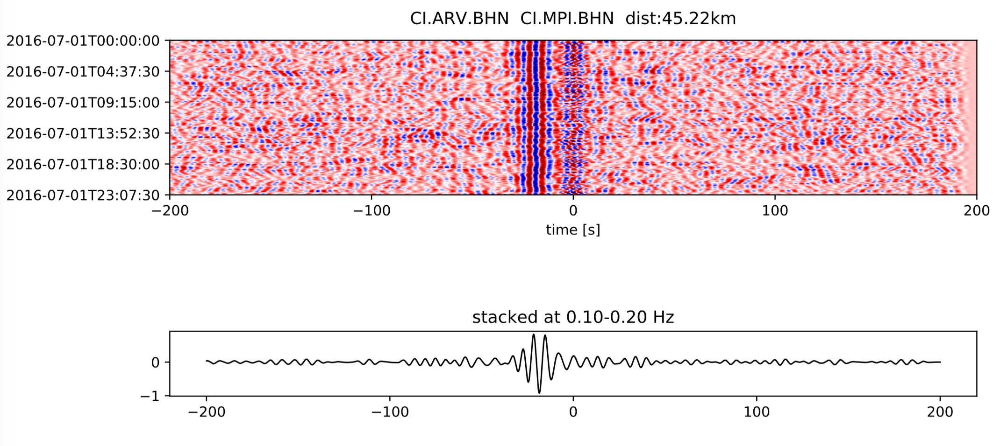
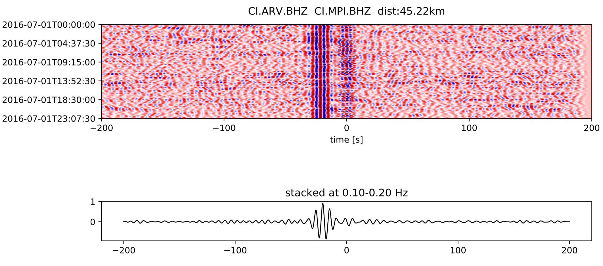
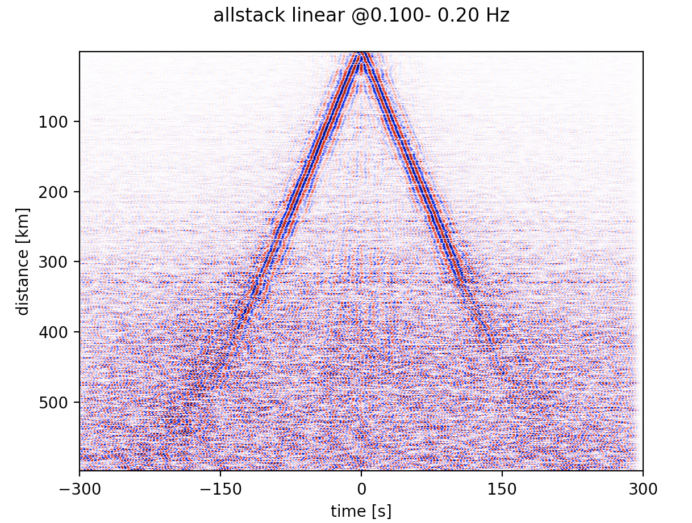

Tutorial
========

.. contents::
    :local:
    :depth: 3

S0A. Downloading seismic noise data
-----------------------------------
The script of *download.py* (located in *src* directory) and its existing parameters allows to download all available broadband CI stations *(BH?)* located in a certain region
and operated during 1/Jul/2016-2/Jul/2016 through the SCEC data center.
In the script, short summary is provided for all input parameters that can be changed according to the user's needs. In the current form of the script, we set *inc_hours=24* to download
day-long continous noise data as well as the meta info and store them into a single ASDF file. To increase the signal-to-noise (SNR) of the final cross-correlation functions
(see Seats et al.,2012 for more details), we break the day-long sequence into smaller segments, each of *cc_len* (s) long with some overlapping defined by *step*. You may wanto to
set *flag* to be *True* if intermediate outputs/operational time is preferred during the downloading process. To run the code on a single core, open the terminal and activate the noisepy
environment before run following command. (NOTE that things may go completely different if you want to run NoisePy on a cluster. Better check it out first!!)

.. code-block:: bash

    $ python download.py

If you want to use multiple cores (e.g, 4), run the script with the following command using `mpi4py <https://mpi4py.readthedocs.io/en/stable/>`_.

.. code-block:: bash

    $ mpirun -n 4 python download.py

The outputted files from S0A include ASDF files containing daily-long (24h) continous noise data, a parameter file recording all used parameters in the script of S0A and a CSV file of
all station information (more details on reading the ASDF files with downloaded data can be found in docs_old/src/ASDF.md). The continous waveforms data stored in the ASDF file can be displayed
using the plotting modules named as *plotting_modules* in the directory of *src* as shown below.

.. code-block:: python

    >>> import plotting_modules (cd to your source file directory first before loading this module)
    >>> sfile = '/Users/chengxin/Documents/SCAL/RAW_DATA/2016_07_01_00_00_00T2016_07_02_00_00_00.h5'
    >>> plotting_modules.plot_waveform(sfile,'CI','BLC',0.01,0.4)

.. note::
    Please note that the script also offers the option to download data from an existing station list in a format same to the outputed CSV file. In this case, *down_list* should be set
    to *True* at L53. In reality, the downloading speed is dependent on many factors such as the original sampling rate of targeted data, the networks, the data center where it is hosted
    and the general structure you want to store on your machine etc. We tested a bunch of the parameters to evaluate their performance and the readers are referred to our paper for more
    details (Jiang et al., 2019).

S0B. Deal with local data
--------------------------------------
The script of `S0B_to_ASDF.py` is developed for the users to handle local data in any format that ObsPy can read  stored on your own disk. Most of the variables are the same as those for
S0A and thus should be pretty straighforward to follow and change. In this script, it preprocesses the data by merging, detrending, demeaning, downsampling, and then trimming before saving them into ASDF format for later NoisePy processing. In particular, we expect the script to deal with very messydata, by which we mean that, seismic data is broken into small
pieces and of messy time info such as overlapping time. REMEMBER to set *messydata* at L62 to *True* when you have messy data! (Tutorials on removing instrument response)

S1. Perform cross correlations
------------------------------
`correlate.py` is the core script of NoisePy, which performs `Fourier transform <https://en.wikipedia.org/wiki/Fourier_transform>`_ to all noise data first and loads them into the
memory before they are further cross-correlated. This means that we are performing `cross-correlation <https://en.wikipedia.org/wiki/Cross-correlation>`_ in the frequency domain.
In the script, we provide several options to calculate the cross correlation, including *raw*, *coherency* and *deconv* (see our paper for detailed definition). We choose *coherency*
as an example here. After running the script, it will create a new folder named *CCF*, in which new ASDF files containing all cross-correlation functions between different station pairs
are located. It also creates a parameter file of *fft_cc_data.txt* that records all useful parameters used in this script. Once you get the cross-correlation file, you can show the daily
temporal variation between all station-pair by calling *plot_substack_cc* function in *plotting_modules* as follows. Note to use this function, the parameter of *substack* at L82 in S1 has to be *True* to allow substacks to be done. Otherwise, it will stack the entire thing in default.

.. code-block:: python

    >>> import plotting_modules
    >>> sfile = '/Users/chengxin/Documents/SCAL/CCF/2016_07_01_00_00_00T2016_07_02_00_00_00.h5'
    >>> plotting_modules.plot_substack_cc(sfile,0.1,0.2,200,True,'/Users/chengxin/Documents/SCAL/CCF/figures')

S2. Do stacking
---------------
The script of `stack.py` is used to assemble and/or stack all cross-correlation functions computed for the staion pairs in S1 and save them into ASDF files for future analysis
(e.g., temporal variation and/or dispersion extraction). In particular, there are two options for the stacking process, including linear and phase weighted stacking (pws). In general,
the pws produces waveforms with high SNR, and the snapshot below shows the waveform comparison from the two stacking methods. We use the folloing commend lines to make the move-out plot.

NoisePy compiles a suite of stacking routines. Please cite appropriate manuscript when using them:
    *  Phase-weighted stacking: Schimmel et al, 1997
    * Selective stack with amp threshold: NoisePy paper
    * Selective stack with a CC threshold: NoisePy paper
    * Time-frequency PWS (Zeng and Thurber 2016)
    * auto-covariance filter (Nakata et al, 2016)
    *  Robust stack (Xiaotao - Pavlis & Vernon, 2010), Yang et al, 2020
    *  Robust stacking with CC threshold, Yang et al, 2020
    *  Nth-root stack (Rost and Thomas?)
    *  Denoise with SVD+Wiener (Moreau et al, 2017)

.. code-block:: python

    >>> import plotting_modules,glob
    >>> sfiles = glob.glob('/Users/chengxin/Documents/SCAL/STACK/*/*.h5')
    >>> plotting_modules.plot_all_moveout(sfiles,'Allstack_linear'0.1,0.2,'ZZ',1,300,True,'/Users/chengxin/Documents/SCAL/STACK') #(move-out for linear stacking)
    >>> plotting_modules.plot_all_moveout(sfiles,'Allstack_pws'0.1,0.2,'ZZ',1,300,True,'/Users/chengxin/Documents/SCAL/STACK')    #(move-out for pws)

