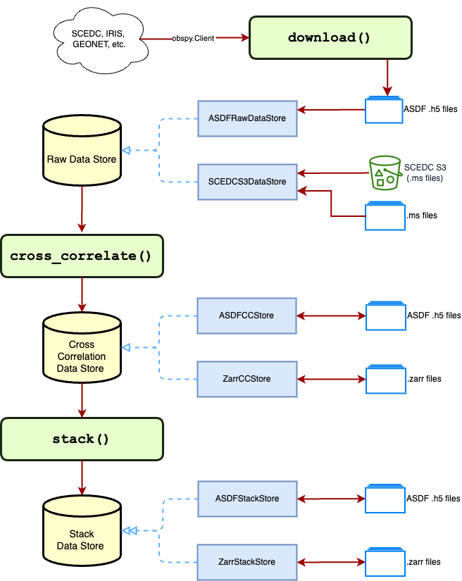

# Configure Noisepy

Welcome to NoisePy!

**Noisepy** is a software to compute large-scale cross correlations for HPC and Cloud infrastructure. The difference in using Noisepy for either infrastructure is the back-end data format that are either file-system (H5) or object-storage (npz/mseed) optimzed.

 **NoisePy** also offers tools for ambient noise monitoring (velocity and attenuation) and for Earth imaging (measuring phase and group velocities).

 NoisePy leverages several efforts published, please consider

* Jiang, C., Denolle, M. 2020. NoisePy: a new high-performance python tool for ambient noise seismology. Seismological Research Letters. 91, 1853-1866. https://doi.10.1785/0220190364.
* Yuan C, Bryan J, Denolle M. Numerical comparison of time-, frequency-and wavelet-domain methods for coda wave interferometry. Geophysical Journal International. 2021 Aug;226(2):828-46.  https://doi.org/10.1093/gji/ggab140
* Yang X, Bryan J, Okubo K, Jiang C, Clements T, Denolle MA. Optimal stacking of noise cross-correlation functions. Geophysical Journal International. 2023 Mar;232(3):1600-18. https://doi.org/10.1093/gji/ggac410


We gratefully acknowledge support from the [Packard Fundation](https://www.packard.org)


## NoisePy Workflow

Noisepy uses various steps:
0. [optional] data download: for users who want to work entirely locally, this step prepares and organize the data in a ``DataStore``.
1. Cross correlations: data may be streamed from the DataStore, which can be hosted on the Cloud, pre-processing and cross correlations are done for each time chunk (e.g., one day for broadband data). Cross-correlations are saved for each time chunck in ``CCStore``.
2. Stacking: Data is aggregated and stacked over all time periods. Stacked data will be stored in ``StackStore``.

Workflow is described in the figure below.


## Applications
### Monitoring
NoisePy includes various functions to measure dv/v. Please check the tutorials. The software will read the ``CCstore`` to aggregate and measure dv/v. The outputs are tabular data in CSV.
Link HERE.
### Imaging
NoisePy includes functions to measure phase and group velocity dispersion curve measurements. The software will read the ``StackStore`` and ouput curves as tabular data in CSV.

## Configuring NoisePy

The ``config.yml`` file contains all parameters to configure NoisePy.

```
start_date: 2019-02-01 00:00:00 # start date of period of interest
end_date: 2019-02-02 00:00:00   # end date of the total period of interest.
samp_freq: 20                   # (Hz) desired sampling rate to process data
cc_len: 3600                  # (sec) window length of the cross-correlation
step: 1800.0                    #  (sec) step window to run through continuous data
lamin: 31                       # minimum latitude if a search is required
lamax: 42                       # maximum latitude if a search is required
lomin: -124                     # minimum longitude if a search is required
lomax: -115                     # maximum longitude if a search is required
freqmin: 0.05                   # (Hz) minimum frequency for pre-processing
freqmax: 2.0                    # (Hz) maximum frequency for pre-processing
freq_norm: rma                  # IMPORTANT: type of frequency normalization ('rma' or 'no)
time_norm: 'no'                 # IMPORTANT: type of temporal normalization
cc_method: xcorr
smooth_N: 10
smoothspect_N: 10
substack: true
substack_len: 3600
maxlag: 200
inc_hours: 12
max_over_std: 10
ncomp: 3
stationxml: false
rm_resp: inv
rm_resp_out: VEL
respdir: null
acorr_only: false
xcorr_only: true
stack_method: linear
keep_substack: false
rotation: true
correction: false
correction_csv: null
down_list: false
net_list:
- '*'
stations:
- *
channels:
- BHE
- BHN
- BHZ
```
